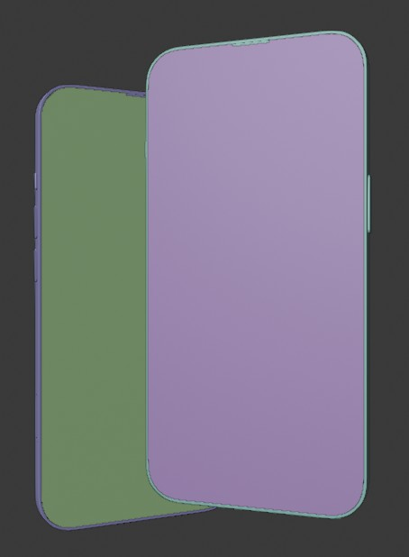
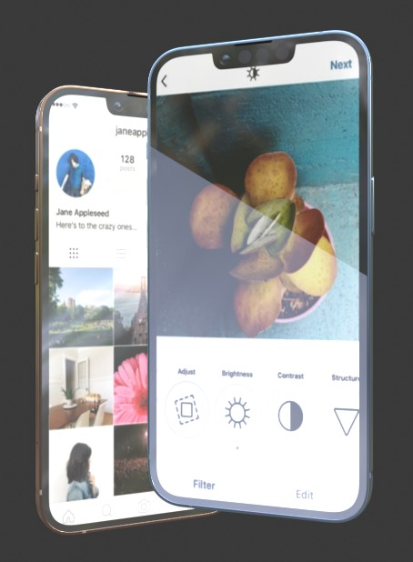

# MomentShare - Tela clone do Instagram

## Autor: Thiago de Oliveira Miranda

Projeto proposto no Bootcamp: HTML Web Developer da plataforma ***Digital Innovation One***.

------

​		O desafio proposto no projeto constituiu em reconstruir a página do login do Instagram aplicando os conceitos de CSS **Flexbox** para tornar layouts mais responsivos e adaptáveis à diversos tamanhos de tela. 

------

* Para concluir o exercício recriei duas telas do Instagram em questão: a tela de login quando o usuário já está *logado* com a conta do **facebook** e a tela de login base onde possui os campos de informações de usuário e senha para serem inseridas.

  Tela 01 e 02 respectivamente:

  <table>
      <tr>
      	<td colspan="2" style="text-align:center;"><h3>Telas do projeto:</h3></td>
      </tr>
      <tr>
      	<td>Tela 01</td>
          <td>Tela 02</td>
      </tr>
      <tr>
      	<td></td>
          <td></td>
      </tr>
      <tr>
      	<td colspan="2" style="text-align:center;"><i>Imagens 01 e 02: Projeto finalizado</i>.</td>
      </tr>
  </table>

------

​		Visando ampliar o aprendizado e a familiaridade com as ferramentas de customização do CSS, recriei o gráfico do mockup de smartphone utilizado na página oficial do **Instagram**, porém adaptando a animação com as transições das telas de exemplo em um vídeo no formato ***.webm***, observando para que o mesmo não comprometesse em muito o tempo de carregamento da página.  Como sugerido no artigo do site: https://medium.com/@trongawesome/gif-vs-video-9b9392ec5814, onde demonstra a eficiência de se utilizar vídeos no formato *.webm* ou *.mp4* ao invés de *.gif* em animações "*embedded*" no contexto da página.

<table>
    <tr>
    	<td>Modelagem em 3D</td>
        <td>Texturas aplicadas</td>
    </tr>
    <tr>
    	<td></td>
        <td></td>
    </tr>
    <tr><td colspan="2" style="text-align:center;"><i>Imagens 03 e 04: Smartphone mockup.</i></td></tr>
</table>

O mockup de smartphone foi modelado e animado em 3D no blender e renderizado em vídeo para ser utilizado em loop contínuo inserido na página.

